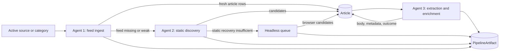

# Pipeline overview

NuSift separates discovery from content extraction so each stage can be bounded, retried, audited, and operated independently.

## Stage contract

1. Agent 1 prefers configured or discovered feeds and persists fresh, article-like URLs.
2. Agent 2 handles targets where feed ingest did not provide sufficient coverage. Static discovery precedes browser work.
3. Agent 3 operates on persisted `Article` rows. It extracts content but does not discover replacement article URLs.
4. `PipelineArtifact` and `PipelineRun` provide audit history, retry evidence, status summaries, and admin observability.

## Key invariants

- URL policy runs before creating avoidable non-article candidates.
- The shared retention window aligns ingestion, discovery, enrichment scope, and cleanup.
- Browser work is bounded and cooldown-aware.
- Success requires durable persistence; a fetch or extraction result alone is not pipeline success.
- Local and production paths should share business logic even when browser execution uses Docker locally.

## Graphify entry points

- [[Graphify/runAgent1Batch().md|runAgent1Batch]]
- [[Graphify/processArticleDiscoveryHeadlessQueue().md|processArticleDiscoveryHeadlessQueue]]
- [[Graphify/runEnrichmentBatch().md|runEnrichmentBatch]]
- [[Graphify/persistCandidates().md|persistCandidates]]

#nusift #pipeline #architecture
